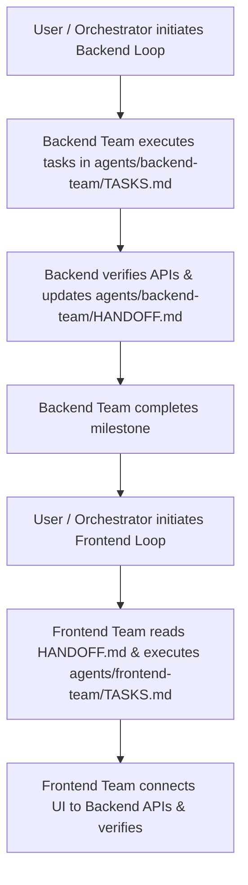

# Multi-Agent Workflow: Backend Team & Frontend Team

This directory manages the multi-agent development workflow for the Multi-Tenant Web-Based Accounting Platform.

## 👥 Team Roles & Responsibilities

### 1. Backend Team (`agents/backend-team/`)
* **Scope**: Microservices development (Node.js/TypeScript or Python), database schema design (PostgreSQL with separate schemas per tenant), authentication & RBAC, REST API endpoints, input validation, and unit/integration testing.
* **Outputs**: Functional API endpoints, database migration scripts, and updated API contracts in `agents/backend-team/HANDOFF.md`.
* **Rules**: 
  - **No Mock Data**: All endpoints must be backed by real database models and verified with integration tests.
  - **Tenant Isolation**: Every database query must strictly enforce tenant logical isolation.
  - **Contract Documentation**: When an API endpoint is complete and verified, document its endpoint, payload, headers, and response structure in `HANDOFF.md`.

### 2. Frontend Team (`agents/frontend-team/`)
* **Scope**: UI/UX development (React.js, TypeScript, TailwindCSS), state management, routing, component library, dynamic tenant branding, and API integration.
* **Outputs**: Responsive, production-grade frontend interfaces consuming backend services.
* **Rules**:
  - **Handoff Dependency**: Frontend team builds components and connects them to real backend APIs documented in `HANDOFF.md`.
  - **No Mock Data**: Integrate with the running backend service directly.
  - **Design Excellence**: Modern UI with dark/light themes, dynamic interactions, and crisp typography.

## 🌿 Git Branching & Pull Request Policy

- **Active Development Branch**: `dev`
- **Feature Branches**: All feature development MUST occur on `feature/<name>` created from `dev`.
- **Pull Requests**: For every push, a Pull Request MUST be created targeting `dev` (or `main` when merging release candidates).
- **PR URL**: `https://github.com/ko2527600/Accounting-Platform/compare/main...dev` (or `gh pr create`).




---

## 🚀 Running Agent Loops

You can initiate agent loops using the provided runner scripts:

### PowerShell (Windows):
```powershell
# Run Backend Team Loop
.\agents\run_loop.ps1 -Team backend

# Run Frontend Team Loop
.\agents\run_loop.ps1 -Team frontend
```

### Bash (Linux/macOS):
```bash
# Run Backend Team Loop
./agents/run_loop.sh backend

# Run Frontend Team Loop
./agents/run_loop.sh frontend
```
